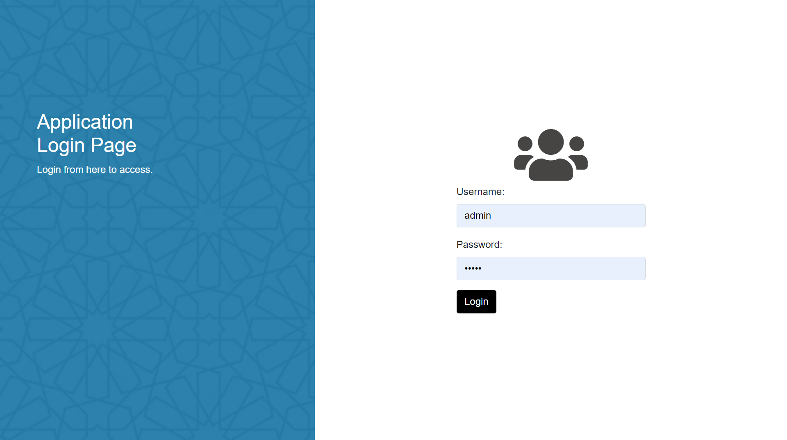
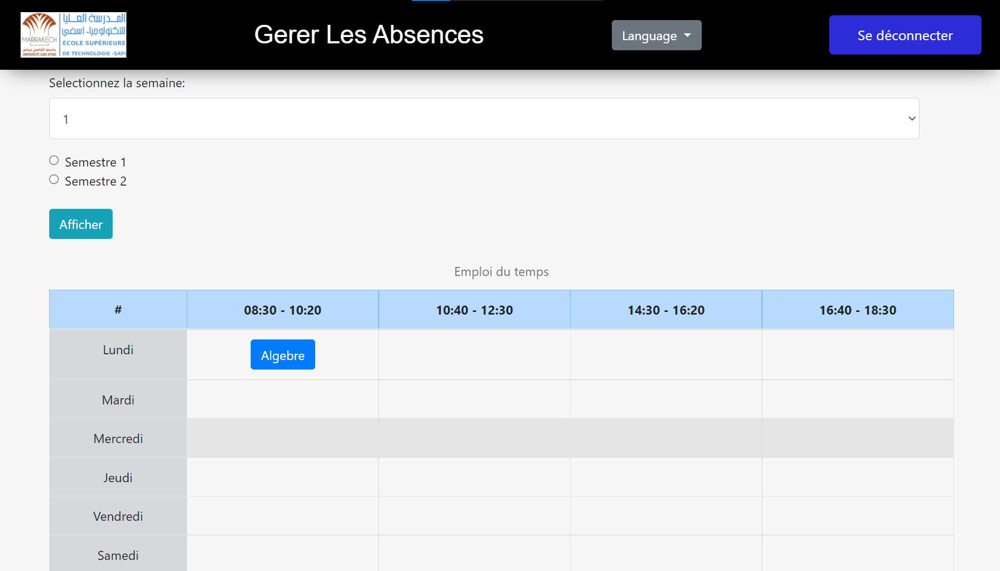
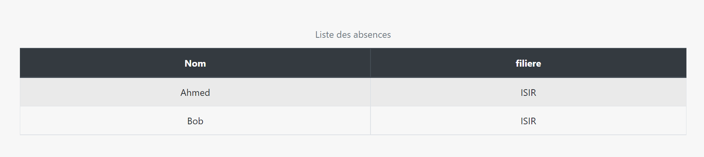
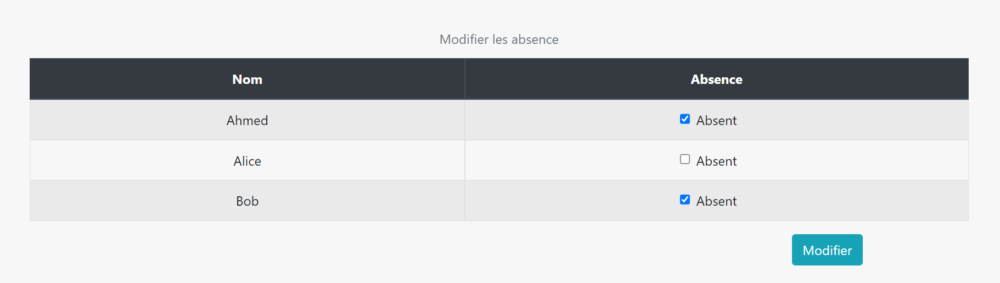
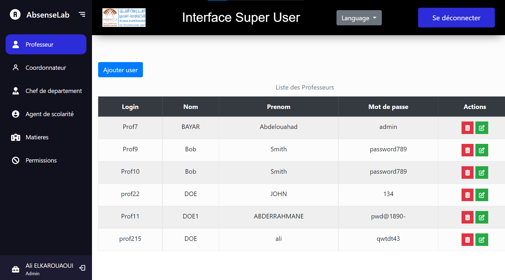

<h2>Brief introduction:</h2>

This is a multilingual web application that allows users with different roles (professors, coordinators, department heads, scholarship agents) to manage attendance. The administrator can manage permissions and subjects using PHP, HTML, CSS, JavaScript, and jQuery.

<h2>Login:</h2>

<h2>Professor interface:</h2>

<h2>Admin interface:</h2>

<h2>🧐 Features</h2>

Here're some of the project's best features:

*   Login/Signup
*   Absence management
*   User management
*   Permission management

  
  
<h2>💻 Built with</h2>

Technologies used in the project:

*   Php
*   Ajax
*   MySQL
*   jQuery/JavaScript
*   Bootstrap

## Preview

You can try the application here https://mhamed-saymik.000webhostapp.com/gestion-absences/ using the following credentials:

- **Admin Interface**
  - Username: admin
  - Password: admin
- **Professor and Other User Interface**
  - Username: prof
  - Password: prof
